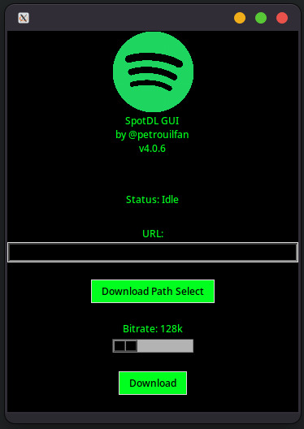

# Simple Spotdl GUI tool

This is a simple GUI program for easier and portable use of the [spotdl](https://github.com/spotDL/spotify-downloader) spotify downloader tool.
It started as a troll or prototype/experiment but I decided to make it a real project some time in the future.
It uses the spotdl binaries instead of the python library because as I said you, when I started I was trolling.
I will most like change it to use the library in the near future.

It also has many bugs in the thread handling but is still usable.

Any small help is appreciated (like fixing bugs, adding features, etc.)

## TODO (you can help with these):
- Fix the thread handling
- Add a progress bar for the download
- Add a way to cancel the download
- Download each playlist in a separate folder
- open for more suggestions :)